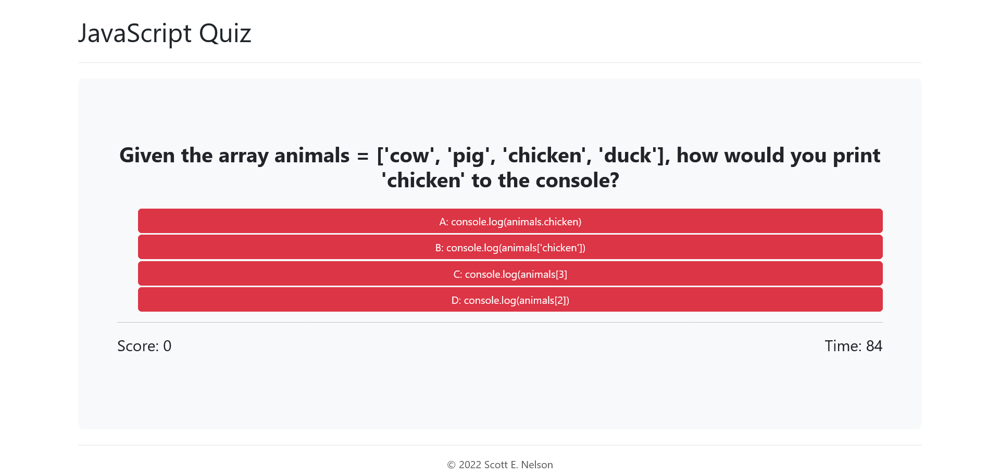

# JavaScript Quiz

## Table of contents

- [Overview](#overview)
  - [The challenge](#the-challenge)
  - [User Story](#user-story)
  - [Acceptance Criteria](#acceptance-criteria)
  - [Screenshot](#screenshot)
  - [Links](#links)
- [My process](#my-process)
  - [Built with](#built-with)
  - [What I learned](#what-i-learned)
  - [Continued development](#continued-development)
  - [Useful resources](#useful-resources)
- [Author](#author)

## Overview

### The challenge

Users should be able to:

- Test their JavaScript knowledge using a timed quiz.
- Save their scores to a persistent scoreboard using local storage

### User Story

```
AS A coding boot camp student
I WANT to take a timed quiz on JavaScript fundamentals that stores high scores
SO THAT I can gauge my progress compared to my peers
```
### Acceptance Criteria

```
GIVEN I am taking a code quiz
WHEN I click the start button
THEN a timer starts and I am presented with a question
WHEN I answer a question
THEN I am presented with another question
WHEN I answer a question incorrectly
THEN time is subtracted from the clock
WHEN all questions are answered or the timer reaches 0
THEN the game is over
WHEN the game is over
THEN I can save my initials and my score
```
### Screenshot



### Links

- Solution URL: [GitHub](https://your-solution-url.com)
- Live Site URL: [GitHub Pages](https://your-live-site-url.com)

## My process

### Built with

- HTML5
- CSS3
- JavaScript
- [jQuery](https://jquery.com/) - JS library
- [Bootstrap](https://getbootstrap.com/) - For styles

### What I learned
I learned a lot about event delegation and event bubbling. I was able to use delegation to handle the answer button events.
It is very easy to delegate event handling with jQuery as follows:

```js
  answerListEl.on("click", ".btn", checkAnswer);
```

### Continued development
In the future I would like to make the design more responsive, and have the questions pulled at random from a database of questions and check the answers on the server side.

### Useful resources
- [MDN](https://developer.mozilla.org/en-US/) 
- [jQuery Documentation](https://api.jquery.com/)

## Author

- Website - [scottenelson.dev](https://www.scottenelson.dev)
- GitHub - [snelson-seattle](https://github.com/snelson-seattle)
- LinkedIn - [Scott E. Nelson](https://www.linkedin.com/in/scottenelson)


